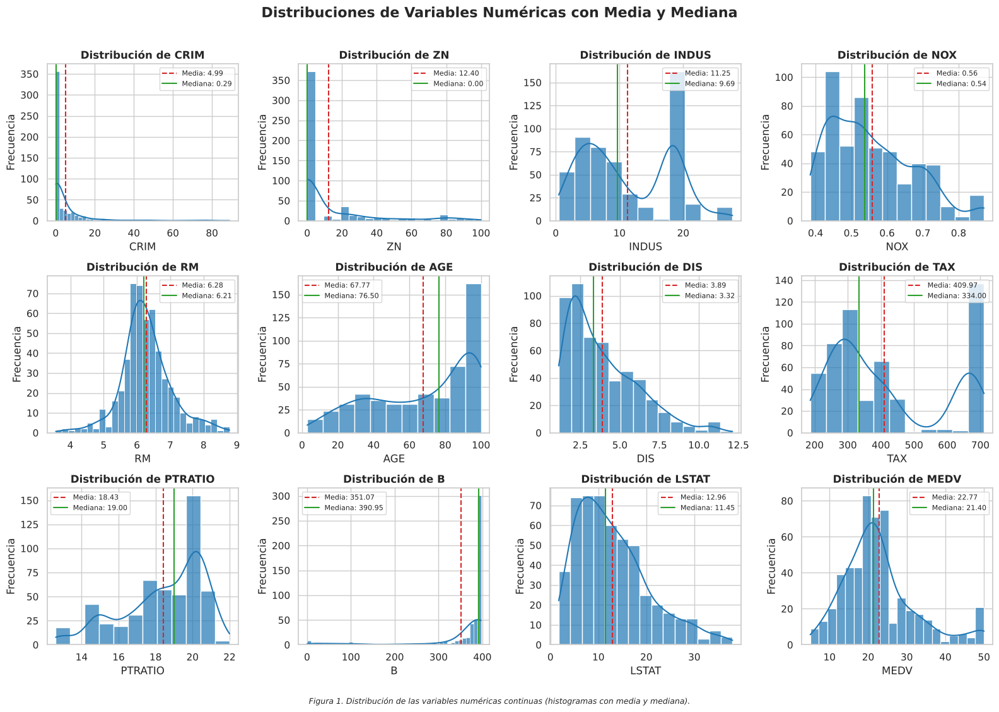
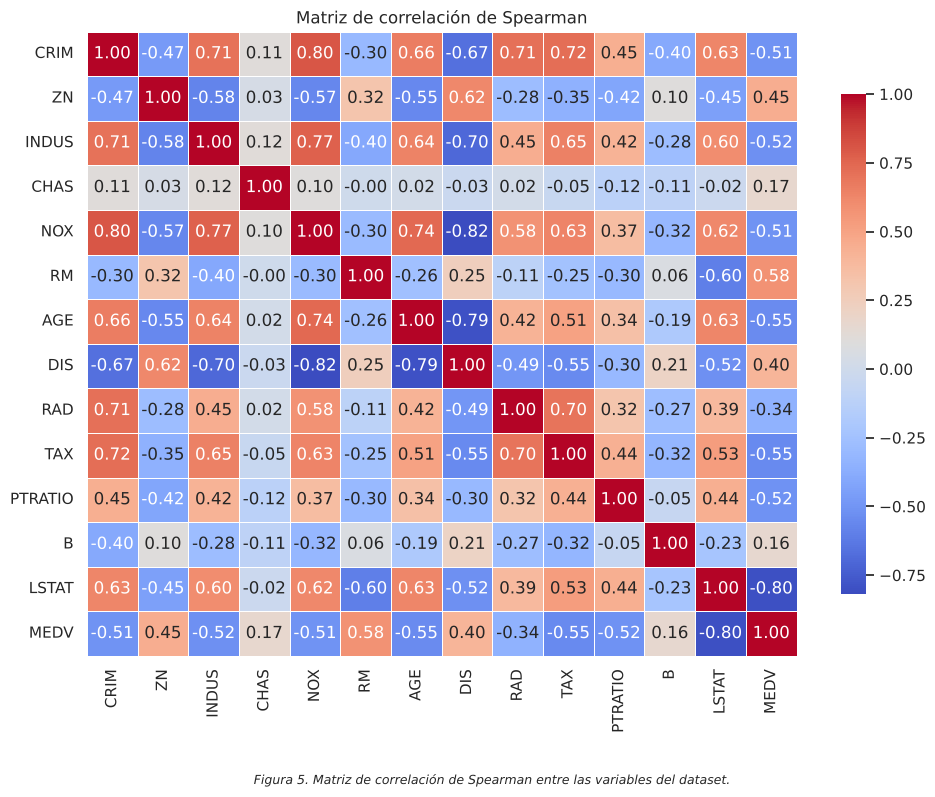
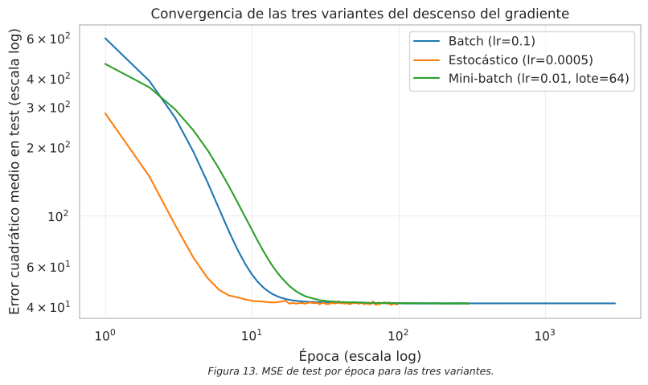
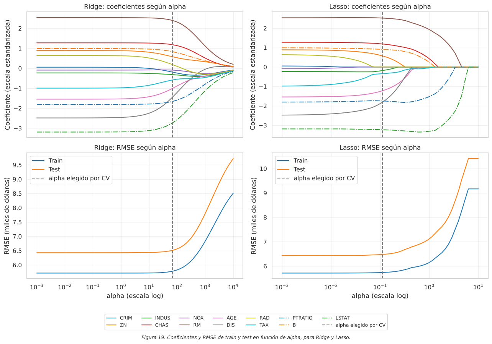

# Predicción de precios de casas con regresión

Trabajo práctico grupal de cuatro integrantes. Aprendizaje Automático 1, Tecnicatura Universitaria en Inteligencia Artificial (FCEIA, UNR), segundo cuatrimestre de 2026.

[English version](README.en.md)

Predecimos `MEDV`, el valor mediano de las viviendas en miles de dólares, a partir de 13 variables de un dataset de 556 registros basado en Boston Housing. Limpiamos e imputamos los datos y comparamos siete modelos: regresión lineal, tres variantes del descenso del gradiente, Ridge, Lasso y ElasticNet. Elegimos la regresión lineal, con un RMSE de 6.43 (miles de dólares) y un R² de 0.62 en test.

## Equipo

Este es un trabajo grupal de cuatro personas:

- Valentino Civetta
- Maximiliano Frank
- Milagros Fucci
- Federico Winter

Repositorio original del grupo: [valentinocivetta04/TP_AA1_Civetta_Fucci_Frank_Winter](https://github.com/valentinocivetta04/TP_AA1_Civetta_Fucci_Frank_Winter).

Este repositorio es una copia en la cuenta de Maximiliano Frank, reorganizada para mostrarla como portfolio. La autoría es del grupo. Trabajamos juntos en reuniones por Discord, y quien compartía pantalla hacía los commits. Por eso el historial de git no refleja quién resolvió cada parte.

## Mi contribución

Participé, igual que el resto del grupo, en todas las sesiones de trabajo. Resolvimos juntos las etapas del notebook: limpieza, análisis exploratorio, imputación, modelado y conclusiones.

## Qué hicimos

- Eliminamos 21 filas sin `MEDV` y 4 filas con más de la mitad de los valores faltantes. Quedaron 531 registros.
- Marcamos como nulos los valores inválidos de `RAD`.
- Detectamos outliers con IQR y contrastamos cada uno con la matriz de correlación de Spearman.
- Separamos train y test antes de escalar e imputar, y escalamos con `RobustScaler`.
- Imputamos las variables continuas con `KNNImputer` (`k = 2`, elegido por la curvatura del método del codo). Imputamos `RAD` y `CHAS` con `CatBoostClassifier`.
- Entrenamos los siete modelos y ajustamos la tasa de aprendizaje, el tamaño del lote y `alpha` (por validación cruzada).

## Resultados clave

Métricas en el conjunto de test, ordenadas por RMSE. MAE y RMSE están en miles de dólares.

| Modelo | MAE test | RMSE test | R² test | RMSE train |
|---|---|---|---|---|
| Descenso del gradiente mini-batch | 4.1995 | 6.4244 | 0.6177 | 5.7154 |
| LinearRegression | 4.2010 | 6.4267 | 0.6174 | 5.7154 |
| Descenso del gradiente batch | 4.2010 | 6.4267 | 0.6174 | 5.7154 |
| Descenso del gradiente estocástico | 4.2127 | 6.4375 | 0.6161 | 5.7166 |
| ElasticNet | 4.2167 | 6.4774 | 0.6114 | 5.7602 |
| Lasso | 4.2354 | 6.4793 | 0.6112 | 5.7393 |
| Ridge | 4.2078 | 6.5089 | 0.6076 | 5.7791 |

- Los siete modelos quedan a menos de 0.1 de RMSE entre sí.
- Train y test dan casi igual (R² de 0.61 y 0.62 en la regresión lineal), así que no hay sobreajuste. Por eso la regularización no mejora las métricas.
- Lasso lleva a cero los coeficientes de `CRIM`, `NOX` y `RAD`.
- El mini-batch supera a `LinearRegression` por 0.002 de RMSE. Atribuimos esa diferencia a la oscilación del método y elegimos `LinearRegression`, que es exacta y no tiene hiperparámetros.

## Gráficos



*Distribución de las variables numéricas, con media y mediana (Figura 1 del notebook).*



*Matriz de correlación de Spearman (Figura 5 del notebook).*



*MSE de test por época para las tres variantes del descenso del gradiente (Figura 13 del notebook).*



*Coeficientes y RMSE de Ridge y Lasso en función de `alpha` (Figura 19 del notebook).*

## Tecnologías

Ejecutado con Python 3.13.16.

| Librería | Versión |
|---|---|
| pandas | 3.0.5 |
| numpy | 2.5.3 |
| matplotlib | 3.11.2 |
| seaborn | 0.13.2 |
| scipy | 1.18.1 |
| scikit-learn | 1.9.1 |
| catboost | 1.2.10 |
| notebook | 7.6.3 |

## Estructura del repositorio

```
TP-regresion-AA1.ipynb     notebook con el análisis completo y los modelos
data/house-prices-tp.csv   dataset entregado por la cátedra
assets/                    gráficos exportados del notebook
requirements.txt           librerías y versiones
README.md                  este archivo
README.en.md               versión en inglés
```

## Cómo ejecutarlo

El notebook lee el dataset con la ruta relativa `./data/house-prices-tp.csv`, así que hay que abrirlo desde la raíz del repositorio.

```bash
git clone https://github.com/MaxiFrank7/Fork_TP_AA1.git
cd Fork_TP_AA1
python -m venv .venv
source .venv/bin/activate
pip install -r requirements.txt
jupyter notebook TP-regresion-AA1.ipynb
```

En Windows, el tercer comando de activación es `.venv\Scripts\activate`.

## Aprendizajes y limitaciones

Lo que aprendimos:

- Separar train y test antes de escalar e imputar evita que el escalador y los imputadores usen información de test.
- La tasa de aprendizaje máxima del descenso del gradiente batch se puede calcular a partir de los datos. En este problema es 0.176.
- Regularizar no ayuda cuando el modelo no sobreajusta.

Limitaciones:

- El modelo deja sin explicar cerca del 40% de la variabilidad del precio. En test erra entre 4.200 dólares (MAE) y 6.400 (RMSE).
- Pensamos que influyen las relaciones no lineales y el techo de 50 en `MEDV`. No lo comprobamos con un gráfico de residuos, así que sigue siendo una hipótesis.
- No probamos otras particiones de train y test. Con diferencias tan chicas entre modelos, el orden podría cambiar.
- El dataset es chico: 531 registros después de la limpieza.
- La variable `B` del dataset original se construye a partir de la composición racial de cada zona. scikit-learn retiró `load_boston` en la versión 1.2 por ese motivo. Usamos el dataset porque lo entregó la cátedra.
- Las funciones del descenso del gradiente provienen del material de la cátedra. Las usamos y las comparamos.
